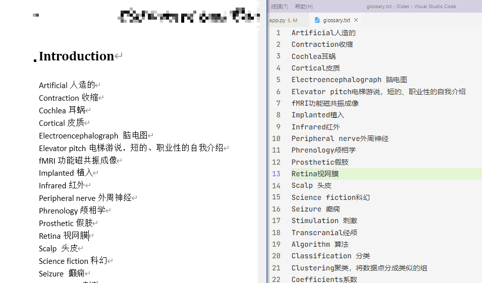

这篇与我以前写的不一样，这篇并不是按我自己实现的时间顺序记叙的，而是**按照更容易理解的方式重新组织了整个过程**。

乐观估计，任何一个有一定python基础语法基础的人都能在1分钟内掌握本文前半部分


首先考虑核心功能：**查字典**即为**输入查询内容——显示查询结果**的过程。因此窗口需要**输入**和**回显**两种控件


# 后端
先实现功能。百度搜索“python 剪贴板”等关键字，得知`pyperclip.copy()`可以实现复制文本到剪贴板

模糊查询用`thefuzz`库解决，浏览首页(`https://github.com/seatgeek/thefuzz`)查阅readme得知最方便我们使用的API就是`thefuzz.process.extractBests(query, choices)`。显然我们查询一个字符串query需要提供目标choices列表。

数据来源为一个word文档，将里面的数据复制到一个文本文件中，手动删掉个位数个标题，命名为`glossary.txt`，如图（由左到右）



读取文件，按行分割得到字符串列表
```python
open("glossary.txt").read().split("\n")
# 这不一定能用，因为：
# Windows下默认行尾为\r\n
# 如遇到解码报错则应以二进制读入再decode()
words_list = open("glossary.txt", "rb").read().decode().split("\r\n")
```
试着查询发现效果不一定好，最后发现是因为有的中英文连在一起了。数据质量一般般，需要进一步格式化（在中英文间加一个空格即可）
```python
glossary = []  # better word list
for string in word_list:
    for i, char in enumerate(string):
        if ord(char) > ord('z'):  # 意味着不是字母或空格
            glossary.append(f"{left.strip()} {right.strip()}")
            break  # 别忘了跳出循环
```
最后封装一下查询代码为一个函数
```python
# functools.cache这个就是标准库中的memoize装饰器，删了略慢而已
from functools import cache
from thefuzz import process

@cache
def search(text):
    return process.extractBests(text, glossary, limit=10)  # 取前十个结果（可调整）
```
真不错！随便搜索一个词试一下吧！
```python
>>> search("plane")
[('Coronal plane 从前看到的面', 90), ('Sagittal plane 从旁边看到的平面', 90), ('Implanted 植入', 72), ('Vigilance （保持）警惕', 72), ...
```
显然，返回值是一个列表，其中每个元素都是一个`元组(字符串, 匹配率)`。至此，后端基本完成。
> 事实上，如果对python的装饰器机制比较熟悉，search()函数可以写成一行
> ```python
> search = cache(lambda text: process.extractBests(text, glossary, limit=10))
> ```
> 但是你这样写IDE就会给你画波浪线😑

# 前端
前端比较随意了，~~甚至都没必要搞~~。但由于**我本来做这个就是为了推销我的另一个GUI框架`Slides`**（基于`glooey`的二次封装，和`FPgui`那个项目完全不同源），所以还是讲一下吧🤣
- `glooey`是一个非常有个性的GUI框架（基于`pyglet`），它的特点是把**颜色**、**对齐**，甚至**大小**这些一般都是实例属性的属性作为类属性来设置。
- 在`glooey`的首页`glooey.readthedocs.io/en/latest/`可以看到它自称 ***an boject-oriented GUI library for pyglet*** 显然也是指的这个意思。在我看来，和声明式的GUI框架相比，`glooey`简直有些异域风情了
- 本文使用的是我个人对`glooey`的一个封装（仓库地址`github.com/CNSeniorious000/Slides`），并实现了一些没那么异域风情的控件
- 之所以起名`Slides`，其实它原本是一个意在实现一些与`PowerPoint`类似功能的库（相关文件可以在`old`文件夹中找到），这个月突然把它翻出来就是因为认识了`glooey`😍，于是就逐渐偏离做这个库的本意了

跑偏了……接下来实现输入框和结果列表。
```python
from slides.core.everything import *
from pyperclip import copy

class MainWindow(UI):
    """主窗口"""
    
    def __init__(self):
        UI.__init__(self)  # or super().__init__()
        vbox = VBox()  # 纵向布局
        self.add(vbox)
        text_field = Form()  # 输入框
        vbox.add(text_field)
        for _ in range(5):
            vbox.add(BaseButton(" "))
        buttons = vbox.get_children()[1:]  # 按钮列表（children第一个是输入框）
        
        def callback(button):
            copy(widget.foreground.text)  # 将按钮上的文字复制到剪贴板
        for button in buttons:
            button.push_handlers(on_click=callback)  # 绑定为按钮点击事件的回调函数
        
        """【关键】以下实现结果列表的更新"""
        
        last = ""  # 初始输入
        def update():
            nonlocal last  # 扩大作用域
            this = text_field.text
            if last == this:
                return  # 没有变化
            last = this  # 有变化，刷新记忆
            for i, result in enumerate(search(this)):
                match, score = result  # 解包
                # match是匹配的字符串，score是匹配率
                # 其实match已经是关键字了 用它做变量名不太好 别学我
                button = buttons[i]  # 第i个按钮
                label = button.foreground  # 按钮上的文本层
                label.text = match  # 有趣的是
                color = (preset.used().text_color[:3], 55 + score * 2)
                # preset.used()返回目前的主题
                # 取主题中text_color的rgb, 但透明度正相关于匹配率
                label.color = color
        self.callback.append(update)  # GUI会自动不断调用这个函数（在每帧重绘前）
```
其实这是我前面展示版本的简化版，但已经足够展示`Slides`的部分特色——
- 主题是运行时用`preset.used`获得的，因此可以在运行时更改主题（目前主要是配色）
  - 在glooey的框架下实现这个真是太难了😭
- 只要把`BaseButton`换成`BoldButton`就有前面展示的**可变字体**的啦！但是它需要手动制定配色，详见完整代码
- 这么点东西写了30行完全是为了在微信下的排版。其实十来行搞定可读性也不会太低

最后，声明入口
```python
if __name__ == '__main__':
    with preset.Vue.using(), MainWindow():
        pass
```
`preset.Vue`是我按`Vue`的配色做的一个主题。`Theme`类和`UI`类都实现了**上下文管理器协议**。结束with块后就会自动调用`pyglet.app.run()`启动主事件循环。

（因此其实完全可以把上面的代码写到`pass`所在的这个块里。那样甚至还能减少一些bug（后话了）~~至于为什么我没有这么做，其实是我写道这段才想起来😂~~）

---

**综上，我介绍了用python中现成的一些库，在50行里实现了一个极轻量的查词app，界面现代，代码清晰。**

最后，欢迎大家光顾我的代码仓库（日更哦）（但现在里面runnable的并不多）

> 本文的源代码在这里下载：
> github.com/CNSeniorious000/Slides/blob/master/examples/dictionary/app.py

也欢迎大家看看我另一个GUI框架`FPgui`，那个更重量级、更底层、完成度更低。~~但我近一个月没碰过了~~


